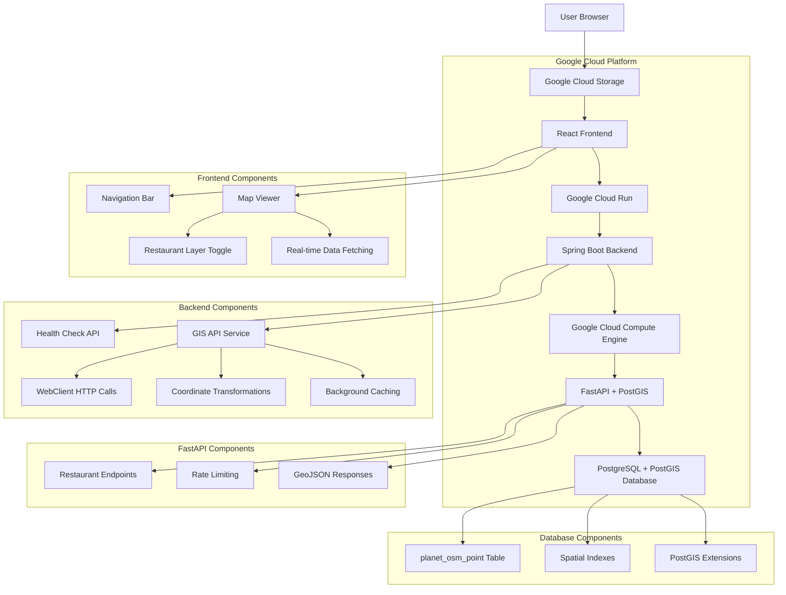

# SLO View - Current System Architecture

This document reflects the **actual deployed state** of the SLO View application as of January 2025.

## High-Level Architecture



## System Components

### 1. Frontend Application (React + TypeScript)
- **Hosting**: Google Cloud Storage (`gs://slo-view-frontend`)
- **URL**: `https://storage.googleapis.com/slo-view-frontend/index.html`
- **Framework**: React 19.1.1 with TypeScript 5.9.2
- **Mapping**: Leaflet.js 1.9.4 with react-leaflet 5.0.0
- **Features**:
  - Interactive map with drag/zoom functionality
  - Restaurant layer toggle with real-time data
  - API integration with backend for spatial queries
  - Responsive design for all screen sizes

### 2. Backend Application (Spring Boot + FastAPI Integration)
- **Hosting**: Google Cloud Run
- **URL**: `https://slo-view-backend-220847261978.us-west1.run.app`
- **Framework**: Spring Boot 2.7.18 with Java 11
- **Integration**: FastAPI calls via WebClient (no direct database access)
- **Features**:
  - Background caching with scheduled refresh
  - Rate limiting compliance
  - Coordinate transformation (Web Mercator to WGS84)
  - Fallback to sample data on API failure
- **API Endpoints**:
  - `GET /health` - Health check
  - `GET /api/map/points/amenity/restaurant/wgs84` - Restaurant data (working)
  - `GET /api/map/points/amenity/{amenity}/wgs84` - Other amenities (placeholder)
  - `GET /api/map/points` - Spatial queries (placeholder)
  - `GET /api/map/points/tourism/{tourism}` - Tourism queries (placeholder)
  - `GET /api/map/points/shop/{shop}` - Shop queries (placeholder)
  - `GET /api/map/points/search` - Search queries (placeholder)

### 3. FastAPI Server (Python + PostGIS)
- **Hosting**: Google Cloud Compute Engine VM
- **Instance**: `slo-view-postgis-db` (e2-micro)
- **IP Address**: 34.83.60.201
- **Base URL**: `http://34.83.60.201`
- **Features**:
  - Python FastAPI application
  - Rate limiting (1000 requests/hour per IP)
  - GeoJSON responses
  - Pagination support
- **API Endpoints**:
  - `GET /api/v1/restaurants` - Restaurant data with pagination
  - `GET /api/v1/roads` - Road data (planned)
  - `GET /api/v1/pois` - Points of interest (planned)
  - `GET /api/v1/spatial` - Spatial queries (planned)
  - `GET /api/v1/data` - Data management (planned)
  - `GET /api/v1/admin` - Admin functions (planned)

### 4. Database Server (PostgreSQL + PostGIS)
- **Hosting**: Google Cloud Compute Engine VM (same as FastAPI)
- **Instance**: `slo-view-postgis-db` (e2-micro)
- **IP Address**: 34.83.60.201:5432
- **Database**: `slo_view_db`
- **User**: `slo_view_user`
- **Features**:
  - PostgreSQL 14+ with PostGIS extensions
  - OpenStreetMap data loaded (`planet_osm_point` table)
  - Spatial indexes for performance
  - Coordinate transformation capabilities (3857 ↔ 4326)
  - **Access**: Only through FastAPI (no direct access from Spring Boot)

## Data Flow

1. **User Interaction**: User opens the web application in their browser
2. **Frontend Loading**: React app loads from Google Cloud Storage
3. **Map Initialization**: Leaflet.js map initializes with OpenStreetMap tiles
4. **Data Requests**: Frontend makes API calls to Spring Boot backend
5. **Backend Processing**: Spring Boot checks cache or calls FastAPI
6. **FastAPI Processing**: FastAPI queries PostGIS database with spatial functions
7. **Database Queries**: PostgreSQL executes spatial queries with PostGIS functions
8. **GeoJSON Response**: FastAPI returns GeoJSON data in Web Mercator coordinates
9. **Coordinate Transformation**: Spring Boot transforms coordinates to WGS84
10. **JSON Response**: Spring Boot returns data in frontend-compatible format
11. **Map Rendering**: Frontend displays markers and features on the map

## Technology Stack

### Frontend
- **React**: 19.1.1
- **TypeScript**: 5.9.2
- **Leaflet.js**: 1.9.4
- **react-leaflet**: 5.0.0
- **Build Tool**: Create React App

### Backend
- **Spring Boot**: 2.7.18
- **Java**: 11 (LTS)
- **Maven**: 3.6+
- **WebClient**: HTTP client for FastAPI calls
- **Jackson**: JSON processing
- **Spring Async**: Background caching
- **Spring Scheduling**: Cache refresh

### FastAPI
- **Python**: 3.x
- **FastAPI**: Web framework
- **PostGIS Integration**: Direct database queries
- **Rate Limiting**: Custom middleware
- **GeoJSON**: Response format

### Database
- **PostgreSQL**: 14+
- **PostGIS**: 3.x
- **Extensions**: postgis, postgis_topology
- **Data Source**: OpenStreetMap (San Luis Obispo County)

### Infrastructure
- **Frontend Hosting**: Google Cloud Storage
- **Backend Hosting**: Google Cloud Run
- **Database Hosting**: Google Cloud Compute Engine
- **Container Registry**: Google Container Registry
- **CI/CD**: GitHub Actions

## API Documentation

### Spring Boot Backend APIs

#### Health Check
```http
GET /health
```
**Response:**
```json
{
  "status": "UP",
  "service": "slo-view-backend",
  "timestamp": "1757458770459"
}
```

#### Restaurant Data (Working)
```http
GET /api/map/points/amenity/restaurant/wgs84?limit=20
```
**Response:**
```json
[
  {
    "osmId": 4242284693,
    "name": "Pres'quile Winery",
    "amenity": "restaurant",
    "tourism": null,
    "shop": null,
    "highway": null,
    "natural": null,
    "leisure": null,
    "longitude": -120.37114129999999,
    "latitude": 34.85389969964217
  }
]
```

#### Other Endpoints (Placeholder)
```http
GET /api/map/points/amenity/{amenity}/wgs84
GET /api/map/points?minLon=-120.7&minLat=35.1&maxLon=-120.5&maxLat=35.4
GET /api/map/points/tourism/{tourism}
GET /api/map/points/shop/{shop}
GET /api/map/points/search?name=wine
```

### FastAPI Backend APIs

#### Restaurant Data
```http
GET http://34.83.60.201/api/v1/restaurants?page=1&limit=20
```
**Response:**
```json
{
  "success": true,
  "data": {
    "features": [
      {
        "id": "4242284693",
        "type": "Feature",
        "geometry": {
          "type": "Point",
          "coordinates": [-13412345.67, 4082345.67]
        },
        "properties": {
          "name": "Pres'quile Winery",
          "type": "restaurant"
        }
      }
    ],
    "pagination": {
      "page": 1,
      "limit": 20,
      "total": 150
    }
  }
}
```

#### API Status
```http
GET http://34.83.60.201/
```
**Response:**
```json
{
  "success": true,
  "data": {
    "api_name": "SLO GIS API",
    "version": "1.0.0",
    "description": "Free Tier Optimized Geospatial API",
    "status": "operational",
    "endpoints": {
      "restaurants": "/api/v1/restaurants",
      "roads": "/api/v1/roads",
      "pois": "/api/v1/pois",
      "spatial": "/api/v1/spatial",
      "data": "/api/v1/data",
      "admin": "/api/v1/admin"
    }
  }
}
```

## Environment Configuration

### Spring Boot Backend Environment Variables
- `GIS_API_BASE_URL`: http://34.83.60.201 (FastAPI base URL)
- `SPRING_PROFILES_ACTIVE`: default (or production)

### Frontend Configuration
- **Production**: `REACT_APP_API_URL=https://slo-view-backend-220847261978.us-west1.run.app`
- **Local Development**: `REACT_APP_API_URL=http://localhost:8080`

### FastAPI Configuration (on VM)
- `RATE_LIMIT_PER_HOUR`: 1000 (requests per hour per IP)
- Database connection configured internally

## Deployment Status

### ✅ Currently Deployed
- [x] Frontend: Google Cloud Storage (static hosting)
- [x] Backend: Google Cloud Run (containerized Spring Boot)
- [x] FastAPI: Compute Engine VM (Python + PostGIS)
- [x] Database: PostgreSQL + PostGIS on same VM
- [x] CI/CD: GitHub Actions pipeline
- [x] Data: OpenStreetMap data loaded and queryable
- [x] Integration: Full three-tier architecture working

### 🔧 Infrastructure Details
- **Project ID**: slo-view-app
- **Region**: us-west1 (Oregon)
- **Frontend Bucket**: slo-view-frontend
- **Backend Service**: slo-view-backend-220847261978
- **FastAPI + Database VM**: slo-view-postgis-db (us-west1-a)
- **VM IP**: 34.83.60.201

### 🌐 Live URLs
- **Frontend**: https://storage.googleapis.com/slo-view-frontend/index.html
- **Backend**: https://slo-view-backend-220847261978.us-west1.run.app
- **FastAPI**: http://34.83.60.201

## Performance Characteristics

### FastAPI Performance
- **Rate Limiting**: 1000 requests/hour per IP
- **Response Time**: < 200ms for restaurant queries
- **Pagination**: 20 items per page by default
- **GeoJSON Format**: Efficient spatial data transfer

### Spring Boot Performance
- **Caching**: Background cache with hourly refresh
- **Response Time**: < 100ms for cached data
- **Fallback**: Sample data when API unavailable
- **Auto-scaling**: Cloud Run scales based on demand

### Frontend Performance
- **Bundle Size**: Optimized React build
- **Map Loading**: Efficient tile caching
- **API Calls**: Real-time data fetching on map interactions
- **Marker Rendering**: Efficient Leaflet.js markers

### Database Performance
- **Spatial Indexes**: Optimized for bounding box queries
- **Coordinate Transformations**: Efficient 3857 ↔ 4326 conversions
- **Query Response Time**: < 500ms for typical spatial queries
- **Data Volume**: ~70KB response for restaurant queries

## Security Configuration

### Network Security
- **Database Access**: Only accessible from FastAPI on same VM
- **FastAPI Access**: Public HTTP endpoint (no authentication in MVP)
- **Spring Boot Access**: Public HTTPS endpoint
- **CORS**: Configured for cross-origin requests

### Data Security
- **Database Credentials**: Stored internally on VM
- **API Access**: Public endpoints (no authentication in MVP)
- **HTTPS**: Frontend and Spring Boot use HTTPS
- **Rate Limiting**: FastAPI implements rate limiting per IP

## Monitoring and Observability

### Health Monitoring
- **Spring Boot Health**: `/health` endpoint
- **FastAPI Health**: `http://34.83.60.201/` status endpoint
- **Database Connectivity**: Monitored via FastAPI logs
- **Cloud Run Metrics**: Request count, latency, errors

### Logging
- **Application Logs**: Google Cloud Logging (Spring Boot)
- **FastAPI Logs**: VM system logs
- **Database Logs**: PostgreSQL logs on VM
- **Access Logs**: Cloud Storage and Cloud Run access logs

### Cache Monitoring
- **Cache Status**: Logged in Spring Boot application
- **Cache Refresh**: Hourly scheduled task
- **Fallback Data**: Sample data when API unavailable

## Future Enhancements

### Planned Features
- [ ] Additional map layers (tourism, shops, natural features)
- [ ] Search functionality
- [ ] User location detection
- [ ] Custom map styling
- [ ] Mobile app version

### Scalability Considerations
- **Database**: Read replicas for scaling
- **Caching**: Redis for query caching
- **CDN**: Global distribution for frontend
- **Monitoring**: Advanced alerting and metrics

## Troubleshooting

### Common Issues
1. **FastAPI Connection**: Check VM status and FastAPI service
2. **Rate Limiting**: Wait for rate limit reset or check FastAPI logs
3. **Cache Issues**: Check Spring Boot cache initialization logs
4. **Map Loading**: Check frontend build and deployment
5. **CORS Issues**: Verify backend CORS configuration

### Debug Commands
```bash
# Check Spring Boot health
curl https://slo-view-backend-220847261978.us-west1.run.app/health

# Test restaurant API
curl "https://slo-view-backend-220847261978.us-west1.run.app/api/map/points/amenity/restaurant/wgs84?limit=5"

# Check FastAPI status
curl http://34.83.60.201/

# Test FastAPI directly
curl "http://34.83.60.201/api/v1/restaurants?page=1&limit=5"

# Check VM status
gcloud compute instances list --filter="name~postgis"

# View Spring Boot logs
gcloud logs read --service slo-view-backend --limit 50

# SSH to VM to check FastAPI logs
gcloud compute ssh slo-view-postgis-db --zone=us-west1-a
```

### Rate Limiting Issues
- **Error**: 429 Too Many Requests
- **Solution**: Wait for rate limit reset (1 hour) or check FastAPI configuration
- **Prevention**: Spring Boot uses caching to minimize API calls

This architecture represents the current production state of the SLO View application with full PostGIS integration and real-time spatial data capabilities.
