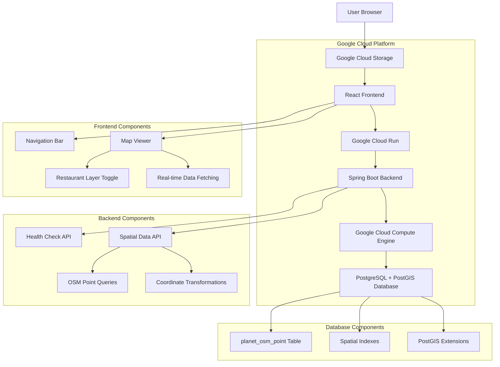

# SLO View - Current System Architecture

This document reflects the **actual deployed state** of the SLO View application as of January 2025.

## High-Level Architecture



## System Components

### 1. Frontend Application (React + TypeScript)
- **Hosting**: Google Cloud Storage (`gs://slo-view-frontend`)
- **URL**: `https://storage.googleapis.com/slo-view-frontend/index.html`
- **Framework**: React 19.1.1 with TypeScript 5.9.2
- **Mapping**: Leaflet.js 1.9.4 with react-leaflet 5.0.0
- **Features**:
  - Interactive map with drag/zoom functionality
  - Restaurant layer toggle with real-time data
  - API integration with backend for spatial queries
  - Responsive design for all screen sizes

### 2. Backend Application (Spring Boot + PostGIS)
- **Hosting**: Google Cloud Run
- **URL**: `https://slo-view-backend-ba5fw55ysa-uw.a.run.app`
- **Framework**: Spring Boot 2.7.18 with Java 11
- **Database Integration**: PostgreSQL + PostGIS via JPA/Hibernate
- **API Endpoints**:
  - `GET /health` - Health check
  - `GET /api/map/points` - Bounded spatial queries
  - `GET /api/map/points/amenity/{amenity}` - Amenity-based queries
  - `GET /api/map/points/amenity/{amenity}/wgs84` - WGS84 coordinate queries
  - `GET /api/map/points/tourism/{tourism}` - Tourism-based queries
  - `GET /api/map/points/shop/{shop}` - Shop-based queries
  - `GET /api/map/points/search` - Name-based search

### 3. Database Server (PostgreSQL + PostGIS)
- **Hosting**: Google Cloud Compute Engine VM
- **Instance**: `slo-view-postgis-db` (e2-micro)
- **IP Address**: 34.83.60.201:5432
- **Database**: `slo_view_db`
- **User**: `slo_view_user`
- **Features**:
  - PostgreSQL 14+ with PostGIS extensions
  - OpenStreetMap data loaded (`planet_osm_point` table)
  - Spatial indexes for performance
  - Coordinate transformation capabilities (3857 ↔ 4326)

## Data Flow

1. **User Interaction**: User opens the web application in their browser
2. **Frontend Loading**: React app loads from Google Cloud Storage
3. **Map Initialization**: Leaflet.js map initializes with OpenStreetMap tiles
4. **Data Requests**: Frontend makes API calls to backend for spatial data
5. **Backend Processing**: Spring Boot processes requests and queries PostGIS
6. **Database Queries**: PostgreSQL executes spatial queries with PostGIS functions
7. **Data Response**: Results returned as JSON with WGS84 coordinates
8. **Map Rendering**: Frontend displays markers and features on the map

## Technology Stack

### Frontend
- **React**: 19.1.1
- **TypeScript**: 5.9.2
- **Leaflet.js**: 1.9.4
- **react-leaflet**: 5.0.0
- **Build Tool**: Create React App

### Backend
- **Spring Boot**: 2.7.18
- **Java**: 11 (LTS)
- **Maven**: 3.6+
- **JPA/Hibernate**: Data persistence
- **Hibernate Spatial**: PostGIS integration
- **JTS**: Java Topology Suite for geometry handling

### Database
- **PostgreSQL**: 14+
- **PostGIS**: 3.x
- **Extensions**: postgis, postgis_topology
- **Data Source**: OpenStreetMap (San Luis Obispo County)

### Infrastructure
- **Frontend Hosting**: Google Cloud Storage
- **Backend Hosting**: Google Cloud Run
- **Database Hosting**: Google Cloud Compute Engine
- **Container Registry**: Google Container Registry
- **CI/CD**: GitHub Actions

## API Documentation

### Health Check
```http
GET /health
```
**Response:**
```json
{
  "status": "UP",
  "service": "slo-view-backend",
  "timestamp": "1757458770459"
}
```

### Spatial Queries
```http
GET /api/map/points/amenity/restaurant/wgs84
```
**Response:**
```json
[
  {
    "osmId": 4242284693,
    "name": "Pres'quile Winery",
    "amenity": "restaurant",
    "tourism": null,
    "shop": null,
    "highway": null,
    "natural": null,
    "leisure": null,
    "longitude": -120.37114129999999,
    "latitude": 34.85389969964217
  }
]
```

### Bounded Queries
```http
GET /api/map/points?minLon=-120.7&minLat=35.1&maxLon=-120.5&maxLat=35.4
```

## Environment Configuration

### Backend Environment Variables
- `DB_HOST`: 34.83.60.201
- `DB_PORT`: 5432
- `DB_NAME`: slo_view_db
- `DB_USERNAME`: slo_view_user
- `DB_PASSWORD`: [configured in GitHub Secrets]

### Frontend Configuration
- `REACT_APP_API_URL`: Backend API URL (auto-detected)

## Deployment Status

### ✅ Currently Deployed
- [x] Frontend: Google Cloud Storage (static hosting)
- [x] Backend: Google Cloud Run (containerized)
- [x] Database: Compute Engine VM (PostgreSQL + PostGIS)
- [x] CI/CD: GitHub Actions pipeline
- [x] Data: OpenStreetMap data loaded and queryable
- [x] Integration: Full frontend-backend-database connectivity

### 🔧 Infrastructure Details
- **Project ID**: slo-view-app
- **Region**: us-west1 (Oregon)
- **Frontend Bucket**: slo-view-frontend
- **Backend Service**: slo-view-backend
- **Database VM**: slo-view-postgis-db (us-west1-a)

## Performance Characteristics

### Database Performance
- **Spatial Indexes**: Optimized for bounding box queries
- **Coordinate Transformations**: Efficient 3857 ↔ 4326 conversions
- **Query Response Time**: < 500ms for typical spatial queries
- **Data Volume**: ~70KB response for restaurant queries

### Frontend Performance
- **Bundle Size**: Optimized React build
- **Map Loading**: Efficient tile caching
- **API Calls**: Real-time data fetching on map interactions

### Backend Performance
- **Response Time**: < 200ms for health checks
- **Spatial Queries**: < 500ms for complex queries
- **Auto-scaling**: Cloud Run scales based on demand
- **Connection Pooling**: HikariCP for database connections

## Security Configuration

### Network Security
- **Database Access**: Restricted to Cloud Run service
- **Public Access**: Only frontend and backend APIs
- **CORS**: Configured for cross-origin requests

### Data Security
- **Database Credentials**: Stored as environment variables
- **API Access**: Public endpoints (no authentication in MVP)
- **HTTPS**: All communications encrypted

## Monitoring and Observability

### Health Monitoring
- **Backend Health**: `/health` endpoint
- **Database Connectivity**: Monitored via application logs
- **Cloud Run Metrics**: Request count, latency, errors

### Logging
- **Application Logs**: Google Cloud Logging
- **Database Logs**: PostgreSQL logs on VM
- **Access Logs**: Cloud Storage and Cloud Run access logs

## Future Enhancements

### Planned Features
- [ ] Additional map layers (tourism, shops, natural features)
- [ ] Search functionality
- [ ] User location detection
- [ ] Custom map styling
- [ ] Mobile app version

### Scalability Considerations
- **Database**: Read replicas for scaling
- **Caching**: Redis for query caching
- **CDN**: Global distribution for frontend
- **Monitoring**: Advanced alerting and metrics

## Troubleshooting

### Common Issues
1. **Database Connection**: Check VM status and firewall rules
2. **API Errors**: Verify environment variables in Cloud Run
3. **Map Loading**: Check frontend build and deployment
4. **CORS Issues**: Verify backend CORS configuration

### Debug Commands
```bash
# Check backend health
curl https://slo-view-backend-ba5fw55ysa-uw.a.run.app/health

# Test spatial API
curl https://slo-view-backend-ba5fw55ysa-uw.a.run.app/api/map/points/amenity/restaurant/wgs84

# Check VM status
gcloud compute instances list --filter="name~postgis"

# View backend logs
gcloud logs read --service slo-view-backend --limit 50
```

This architecture represents the current production state of the SLO View application with full PostGIS integration and real-time spatial data capabilities.
