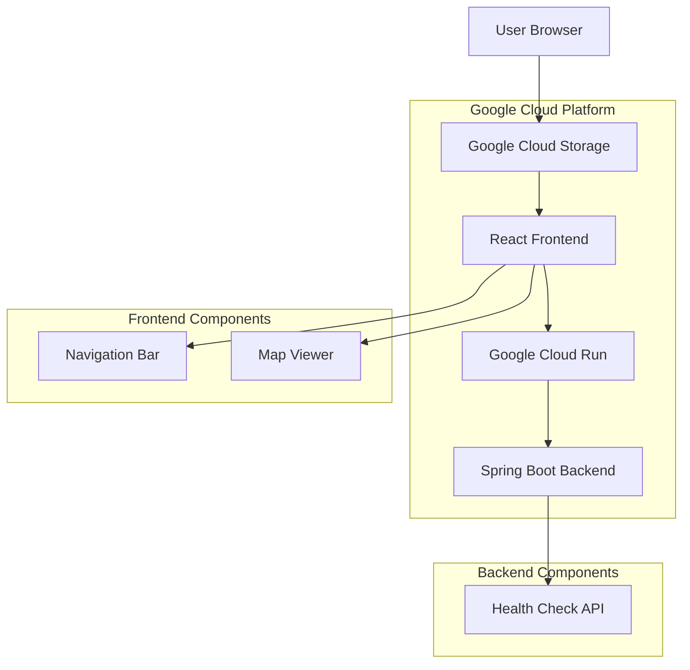

# SLO View - System Architecture

This document outlines the system architecture and technical specifications for the SLO View application.

## High-Level Architecture



## System Components

### Frontend Application
- **Framework**: React 19+ with TypeScript
- **Mapping**: Leaflet.js with OpenStreetMap data
- **Hosting**: Google Cloud Storage (static website)
- **Components**:
  - Navigation Bar: Displays "SLO View" title
  - Map Viewer: Interactive map with drag/zoom functionality

### Backend Application
- **Framework**: Spring Boot 2.7+
- **Language**: Java 11+
- **Hosting**: Google Cloud Run (serverless containers)
- **API**: Health check endpoint at `/health`

## Technology Stack

### Frontend Technologies
- **React**: 19.1.1 with TypeScript 5.9.2
- **Mapping**: Leaflet.js 1.9.4 with react-leaflet 5.0.0
- **Styling**: CSS3 with responsive design
- **Build Tool**: Create React App with TypeScript

### Backend Technologies
- **Spring Boot**: 2.7.18
- **Java**: 11+ (LTS)
- **Build Tool**: Maven
- **Containerization**: Docker

### Infrastructure
- **Frontend Hosting**: Google Cloud Storage
- **Backend Hosting**: Google Cloud Run
- **Container Registry**: Google Container Registry
- **CI/CD**: GitHub Actions

## Project Structure

```
SLOView/
├── slo-view-frontend/          # React TypeScript Frontend
│   ├── src/
│   │   ├── components/
│   │   │   ├── Navbar/         # Navigation component
│   │   │   └── MapViewer/      # Interactive map component
│   │   ├── App.tsx
│   │   └── index.tsx
│   ├── package.json
│   └── tsconfig.json
├── slo-view-backend/           # Spring Boot Backend
│   ├── src/main/java/com/sloview/
│   │   ├── SLOViewApplication.java
│   │   └── controller/
│   │       └── HealthController.java
│   ├── Dockerfile
│   └── pom.xml
└── scripts/                    # Deployment scripts
```

## API Specifications

### Backend Endpoints
| Endpoint | Method | Purpose | Response |
|----------|--------|---------|----------|
| `/health` | GET | Health check | `{ "status": "UP", "service": "slo-view-backend", "timestamp": "..." }` |

### Frontend Integration
- **Map Data**: OpenStreetMap tile server
- **Authentication**: None required for MVP
- **Caching**: Local tile caching for performance

## Deployment Architecture

### Frontend Deployment
- **Hosting**: Google Cloud Storage bucket
- **Configuration**: Static website hosting
- **Security**: HTTPS via Google Cloud
- **Performance**: CDN-ready static assets

### Backend Deployment
- **Hosting**: Google Cloud Run
- **Containerization**: Docker with multi-stage builds
- **Scaling**: Auto-scaling based on traffic
- **Security**: HTTPS endpoint with proper headers

## Development Environment

### Prerequisites
- **Node.js**: 18+ for frontend development
- **Java**: 11+ JDK for backend development
- **Maven**: 3.6+ for dependency management
- **Docker**: For containerization
- **Google Cloud SDK**: For deployment

### Local Development
```bash
# Frontend
cd slo-view-frontend
npm install
npm start

# Backend
cd slo-view-backend
mvn spring-boot:run
```

## Security Architecture

### Frontend Security
- **Content Security Policy**: Implemented for XSS protection
- **HTTPS Only**: All communications encrypted
- **No Sensitive Data**: No secrets stored in frontend

### Backend Security
- **Service Account**: Minimal required permissions
- **Input Validation**: Proper request validation
- **Secure Headers**: Security headers configured
- **Container Security**: Non-root user in containers

## Performance Considerations

### Frontend Performance
- **Bundle Optimization**: React build optimized for production
- **Map Loading**: Efficient tile loading with caching
- **Responsive Design**: Fast rendering on all devices

### Backend Performance
- **Health Checks**: Fast response times
- **Container Optimization**: Efficient Docker images
- **Auto-scaling**: Scales based on demand

## Monitoring & Observability

### Application Monitoring
- **Health Checks**: Built-in health endpoints
- **Logging**: Google Cloud Logging integration
- **Metrics**: Google Cloud Monitoring

### Infrastructure Monitoring
- **Cloud Run Metrics**: Request count, latency, errors
- **Cloud Storage Metrics**: Access patterns, costs
- **Cost Monitoring**: Billing alerts and optimization

## Future Enhancements

### Planned Features
- Custom map styling for SLO county
- Additional map layers (satellite, terrain)
- User location detection
- Map markers for points of interest
- Search functionality

### Scalability Considerations
- **Frontend**: CDN distribution for global performance
- **Backend**: Cloud Run auto-scaling handles traffic spikes
- **Database**: Ready for future database integration
- **Caching**: Redis integration for advanced caching

This document outlines the system architecture and technical specifications for the SLO View application.

## High-Level Architecture


## System Components

### Frontend Application
- **Framework**: React 19+ with TypeScript
- **Mapping**: Leaflet.js with OpenStreetMap data
- **Hosting**: Google Cloud Storage (static website)
- **Components**:
  - Navigation Bar: Displays "SLO View" title
  - Map Viewer: Interactive map with drag/zoom functionality

### Backend Application
- **Framework**: Spring Boot 2.7+
- **Language**: Java 11+
- **Hosting**: Google Cloud Run (serverless containers)
- **API**: Health check endpoint at `/health`

## Technology Stack

### Frontend Technologies
- **React**: 19.1.1 with TypeScript 5.9.2
- **Mapping**: Leaflet.js 1.9.4 with react-leaflet 5.0.0
- **Styling**: CSS3 with responsive design
- **Build Tool**: Create React App with TypeScript

### Backend Technologies
- **Spring Boot**: 2.7.18
- **Java**: 11+ (LTS)
- **Build Tool**: Maven
- **Containerization**: Docker

### Infrastructure
- **Frontend Hosting**: Google Cloud Storage
- **Backend Hosting**: Google Cloud Run
- **Container Registry**: Google Container Registry
- **CI/CD**: GitHub Actions

## Project Structure

```
SLOView/
├── slo-view-frontend/          # React TypeScript Frontend
│   ├── src/
│   │   ├── components/
│   │   │   ├── Navbar/         # Navigation component
│   │   │   └── MapViewer/      # Interactive map component
│   │   ├── App.tsx
│   │   └── index.tsx
│   ├── package.json
│   └── tsconfig.json
├── slo-view-backend/           # Spring Boot Backend
│   ├── src/main/java/com/sloview/
│   │   ├── SLOViewApplication.java
│   │   └── controller/
│   │       └── HealthController.java
│   ├── Dockerfile
│   └── pom.xml
└── scripts/                    # Deployment scripts
```

## API Specifications

### Backend Endpoints
| Endpoint | Method | Purpose | Response |
|----------|--------|---------|----------|
| `/health` | GET | Health check | `{ "status": "UP", "service": "slo-view-backend", "timestamp": "..." }` |

### Frontend Integration
- **Map Data**: OpenStreetMap tile server
- **Authentication**: None required for MVP
- **Caching**: Local tile caching for performance

## Deployment Architecture

### Frontend Deployment
- **Hosting**: Google Cloud Storage bucket
- **Configuration**: Static website hosting
- **Security**: HTTPS via Google Cloud
- **Performance**: CDN-ready static assets

### Backend Deployment
- **Hosting**: Google Cloud Run
- **Containerization**: Docker with multi-stage builds
- **Scaling**: Auto-scaling based on traffic
- **Security**: HTTPS endpoint with proper headers

## Development Environment

### Prerequisites
- **Node.js**: 18+ for frontend development
- **Java**: 11+ JDK for backend development
- **Maven**: 3.6+ for dependency management
- **Docker**: For containerization
- **Google Cloud SDK**: For deployment

### Local Development
```bash
# Frontend
cd slo-view-frontend
npm install
npm start

# Backend
cd slo-view-backend
mvn spring-boot:run
```

## Security Architecture

### Frontend Security
- **Content Security Policy**: Implemented for XSS protection
- **HTTPS Only**: All communications encrypted
- **No Sensitive Data**: No secrets stored in frontend

### Backend Security
- **Service Account**: Minimal required permissions
- **Input Validation**: Proper request validation
- **Secure Headers**: Security headers configured
- **Container Security**: Non-root user in containers

## Performance Considerations

### Frontend Performance
- **Bundle Optimization**: React build optimized for production
- **Map Loading**: Efficient tile loading with caching
- **Responsive Design**: Fast rendering on all devices

### Backend Performance
- **Health Checks**: Fast response times
- **Container Optimization**: Efficient Docker images
- **Auto-scaling**: Scales based on demand

## Monitoring & Observability

### Application Monitoring
- **Health Checks**: Built-in health endpoints
- **Logging**: Google Cloud Logging integration
- **Metrics**: Google Cloud Monitoring

### Infrastructure Monitoring
- **Cloud Run Metrics**: Request count, latency, errors
- **Cloud Storage Metrics**: Access patterns, costs
- **Cost Monitoring**: Billing alerts and optimization

## Future Enhancements

### Planned Features
- Custom map styling for SLO county
- Additional map layers (satellite, terrain)
- User location detection
- Map markers for points of interest
- Search functionality

### Scalability Considerations
- **Frontend**: CDN distribution for global performance
- **Backend**: Cloud Run auto-scaling handles traffic spikes
- **Database**: Ready for future database integration
- **Caching**: Redis integration for advanced caching