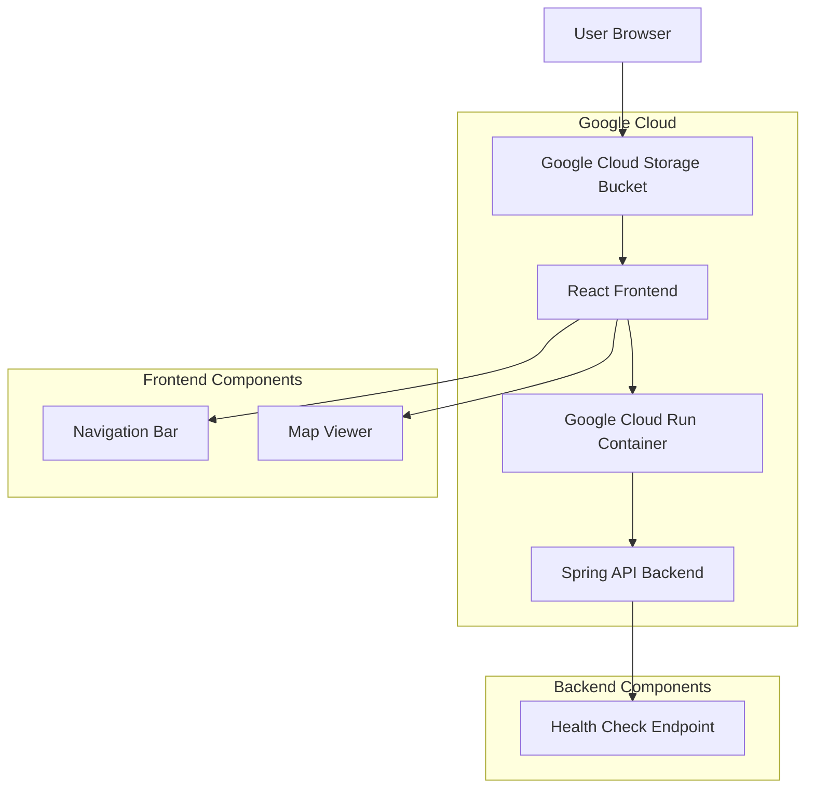

# SLO View Application Architecture

## High-Level Architecture Diagram



## System Components

### 1. React Frontend (Hosted in Google Cloud Storage)
- **Navigation Bar**: Displays "SLO View" site title
- **Map Viewer**: 
  - San Luis Obispo county map
  - Drag-to-move functionality
  - Zoom in/out capability
  - Local map data storage (to minimize API calls)

### 2. Spring API Backend (Hosted in Google Cloud Run)
- **Health Check Endpoint**: Basic endpoint to verify service availability
- Minimal functionality for MVP

## Repository Structure

Since separate repositories are preferred, we'll have:

### Frontend Repository
```
slo-view-frontend/
├── public/
│   ├── index.html
│   └── map-data/ (if using local map data)
├── src/
│   ├── components/
│   │   ├── Navbar.js
│   │   └── MapViewer.js
│   ├── App.js
│   ├── App.css
│   └── index.js
├── package.json
└── README.md
```

### Backend Repository
```
slo-view-backend/
├── src/
│   └── main/
│       ├── java/com/sloview/
│       │   ├── SLOViewApplication.java
│       │   └── controller/
│       │       └── HealthController.java
│       └── resources/
│           └── application.properties
├── pom.xml
└── README.md
```

## Technology Stack

### Frontend
- React.js
- Google Maps API (assumed for now, pending confirmation)
- CSS3 for styling
- JavaScript/ES6+

### Backend
- Spring Boot 2.x
- Java 11+
- Maven for dependency management

## Deployment Architecture

### Frontend Deployment
- Hosted in Google Cloud Storage bucket
- Configured for static website hosting
- Custom domain (if applicable)
- SSL certificate via Google Cloud

### Backend Deployment
- Containerized application
- Deployed to Google Cloud Run
- Auto-scaling capabilities
- HTTPS endpoint

## Development Workflow

1. Developers clone respective repositories
2. Frontend: `npm install` and `npm start` for local development
3. Backend: `mvn spring-boot:run` for local development
4. Pull requests for feature development
5. Code review process
6. CI/CD pipelines for automated testing and deployment

## Cost Considerations

- Google Cloud Storage (static hosting) - Free tier available
- Google Cloud Run (serverless containers) - Free tier available
- Google Maps API - Free tier available (pending confirmation)
- Egress between Google Cloud services is free